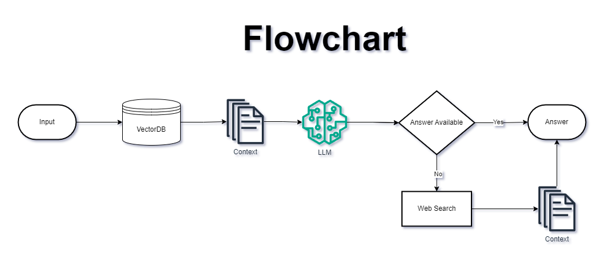

# Agentic_RAG

<br>

## Problem Statement

`Design and implement a system that answers user question related to Indian Tax and GST regulations using official documents, and automatically falls back to web search when the required information is not available in documents. `

## Flowchart



## Techstack

`Python - Programming Language`  
`Fastapi - Development`  
`Langchain - LLMs and components integration`  
`Langgraph - Workflow/Graph Building`  
`Openai - LLM Model`  
`ChromaDB - Vectorstore`  
`Tavily - Web Search`  

<br><br>

## How To Build : 

#### Step 1 : Github Repository Creation 

#### Step 2 : Create environment file

#### Step 3 : Create Requirements.txt file. 

#### Step 4 : Create Setup File

#### Step 5 : Create Virtual Environment

`using uv`
```bash 
uv --version
uv venv .venv
.venv\scripts\activate   |  source .venv/bin/activate
uv pip install -r requirements.txt
uv pip list  

- Run file command
uv run python -m src.components.data_ingestion
```

- Run command in terminal to run inside environment.

```bash
.venv\scripts\activate
```
#### Step 6 : Add venv and .env to .gitignore

#### Step 7 : Create basic folder structure

#### Step 8 : Import fastapi in main file and create health route for check api's working and packages installed properly. 

```bash 
uv run python -m uvicorn src.main:app --reload
```

#### Step 9 : push basic folder structure to github

#### Step 10 : Create notebook/research folder and start research and creating components. 

- Create Required functions 
1. Read pdf files. 
2. Apply embeddings on text.  
3. Store in vectordb. 
4. Create Retriever 

- Create data ingestion component. 

5. create function for get llm model. 

- Create vectordb tool for RAG.
- Create validation tool for validate retrieved context.
- Create websearch tool for fallback. 

6. Create graph using langgraph. 

- Create state
- Create nodes for each function and conditions. 
- Create Graph. 
- Test with questions. 

#### Step 11 : Create structure for graph. 

- Create tools forlder and store all tools inside. 
- Create state folder to store schemas. 
- Create nodes folder to store all nodes. 
- Create Graph component for create graph.

#### Step 12 : Create API's 

- Create api's for vector store creation and user q&a

- Run below command to start app
```bash
uv run python -m uvicorn src.main:app --reload
```

- Test endpoints(Using SwaggerUI)
```bash
http://127.0.0.1:8000/docs
```